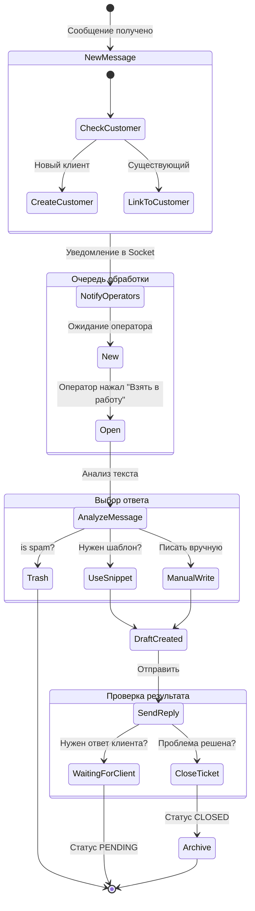

# Activity Diagram

```mermaid 
stateDiagram-v2
    [*] --> NewMessage: Сообщение получено
    
    state NewMessage {
        [*] --> CheckCustomer
        CheckCustomer --> CreateCustomer: Новый клиент
        CheckCustomer --> LinkToCustomer: Существующий
    }

    NewMessage --> NotifyOperators: Уведомление в Socket
    
    state "Очередь обработки" as Queue {
        NotifyOperators --> New: Ожидание оператора
        New --> Open: Оператор нажал "Взять в работу"
    }

    Open --> AnalyzeMessage: Анализ текста
    
    state "Выбор ответа" as Choice {
        AnalyzeMessage --> UseSnippet: Нужен шаблон?
        AnalyzeMessage --> ManualWrite: Писать вручную
        AnalyzeMessage --> Trash: is spam?
    }

    Trash --> [*]
    UseSnippet --> DraftCreated
    ManualWrite --> DraftCreated

    DraftCreated --> SendReply: Отправить
    
    state "Проверка результата" as Decision {
        SendReply --> WaitingForClient: Нужен ответ клиента?
        SendReply --> CloseTicket: Проблема решена?
    }

    WaitingForClient --> [*]: Статус PENDING
    CloseTicket --> Archive: Статус CLOSED
    Archive --> [*]
```