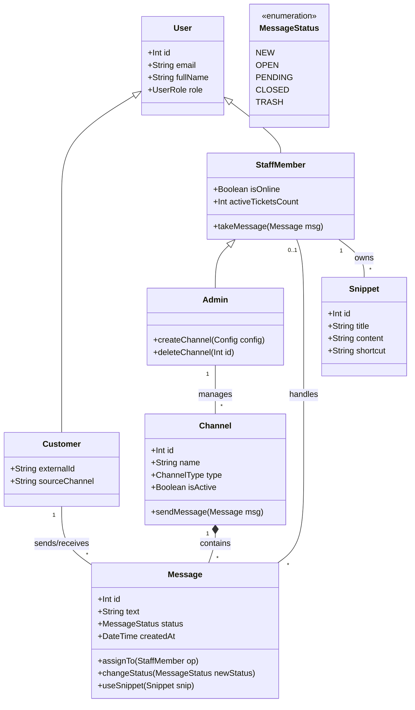

# Class Diagram

```mermaid
classDiagram
    direction TB

    User <|-- Customer
    User <|-- StaffMember
    StaffMember <|-- Admin

    Channel "1" *-- "*" Message : contains
    Customer "1" -- "*" Message : sends/receives
    StaffMember "0..1" -- "*" Message : handles
    StaffMember "1" -- "*" Snippet : owns
    Admin "1" -- "*" Channel : manages

    class User {
        +Int id
        +String email
        +String fullName
        +UserRole role
    }

    class Customer {
        +String externalId
        +String sourceChannel
    }

    class StaffMember {
        +Boolean isOnline
        +Int activeTicketsCount
        +takeMessage(Message msg)
    }

    class Admin {
        +createChannel(Config config)
        +deleteChannel(Int id)
    }

    class Channel {
        +Int id
        +String name
        +ChannelType type
        +Boolean isActive
        +sendMessage(Message msg)
    }

    class Message {
        +Int id
        +String text
        +MessageStatus status
        +DateTime createdAt
        +assignTo(StaffMember op)
        +changeStatus(MessageStatus newStatus)
        +useSnippet(Snippet snip)
    }

    class Snippet {
        +Int id
        +String title
        +String content
        +String shortcut
    }

    class MessageStatus {
        <<enumeration>>
        NEW
        OPEN
        PENDING
        CLOSED
        TRASH
    }
```