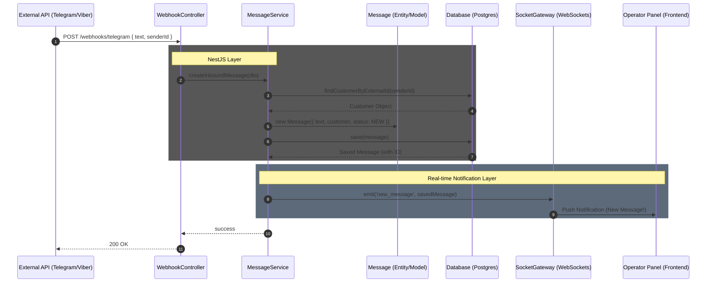
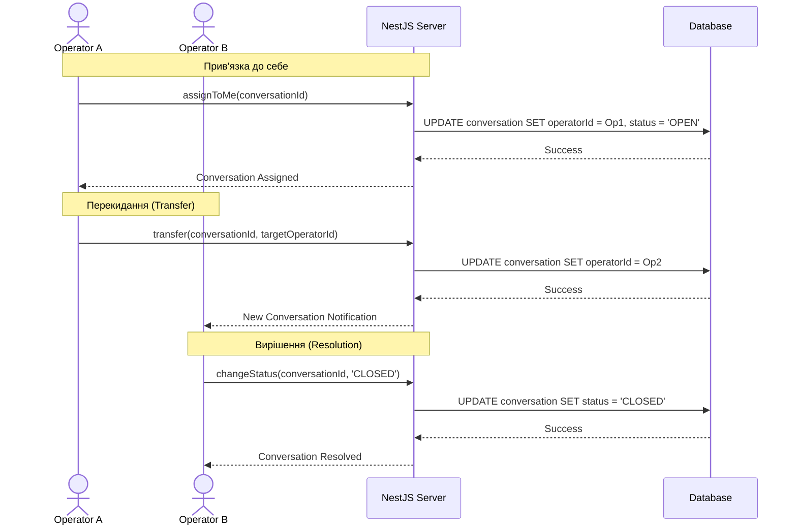

# Sequence Digarams
## Inbound Message Flow

```mermaid
sequenceDiagram
    autonumber
    participant ExternalAPI as External API (Telegram/Viber)
    participant Webhook as WebhookController
    participant Service as MessageService
    participant Domain as Message (Entity/Model)
    participant DB as Database (Postgres)
    participant Socket as SocketGateway (WebSockets)
    participant Operator as Operator Panel (Frontend)

    ExternalAPI->>Webhook: POST /webhooks/telegram { text, senderId }
    
    rect rgb(87, 87, 87)
        Note over Webhook, Service: NestJS Layer
        Webhook->>Service: createInboundMessage(dto)
        
        Service->>DB: findCustomerByExternalId(senderId)
        DB-->>Service: Customer Object
        
        Service->>Domain: new Message({ text, customer, status: NEW })
        
        Service->>DB: save(message)
        DB-->>Service: Saved Message (with ID)
    end

    rect rgb(93, 106, 122)
        Note over Service, Operator: Real-time Notification Layer
        Service->>Socket: emit('new_message', savedMessage)
        Socket->>Operator: Push Notification (New Message!)
    end

    Service-->>Webhook: success
    Webhook-->>ExternalAPI: 200 OK
```

## Message assinging

```mermaid
sequenceDiagram
    actor Op1 as Operator A
    actor Op2 as Operator B
    participant API as NestJS Server
    participant DB as Database

    Note over Op1, API: Прив'язка до себе
    Op1->>API: assignToMe(conversationId)
    API->>DB: UPDATE conversation SET operatorId = Op1, status = 'OPEN'
    DB-->>API: Success
    API-->>Op1: Conversation Assigned

    Note over Op1, Op2: Перекидання (Transfer)
    Op1->>API: transfer(conversationId, targetOperatorId)
    API->>DB: UPDATE conversation SET operatorId = Op2
    DB-->>API: Success
    API-->>Op2: New Conversation Notification

    Note over Op2, API: Вирішення (Resolution)
    Op2->>API: changeStatus(conversationId, 'CLOSED')
    API->>DB: UPDATE conversation SET status = 'CLOSED'
    DB-->>API: Success
    API-->>Op2: Conversation Resolved
```

# 