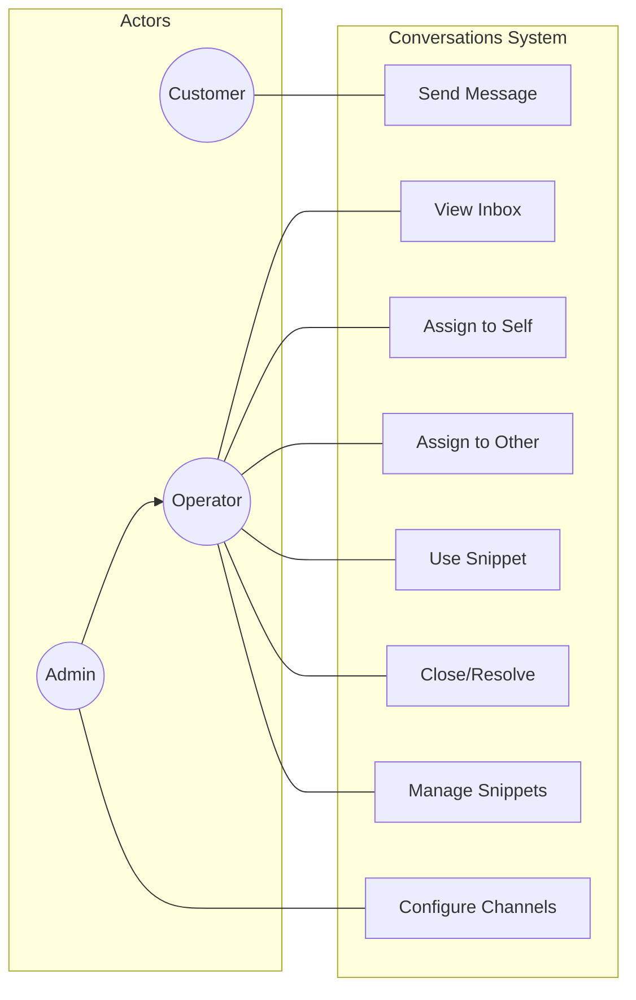

# Use-Case Diagram

```mermaid
graph LR
    subgraph Actors
        C((Customer))
        O((Operator))
        A((Admin))
    end

    subgraph "Conversations System"
        UC1[Send Message]
        UC2[View Inbox]
        UC3[Assign to Self]
        UC4[Assign to Other]
        UC5[Use Snippet]
        UC6[Close/Resolve]
        UC7[Manage Snippets]
        UC8[Configure Channels]
        
    end

    C --- UC1
    
    O --- UC2
    O --- UC3
    O --- UC4
    O --- UC5
    O --- UC6
    O --- UC7
    
    A --> O
    A --- UC8
```
